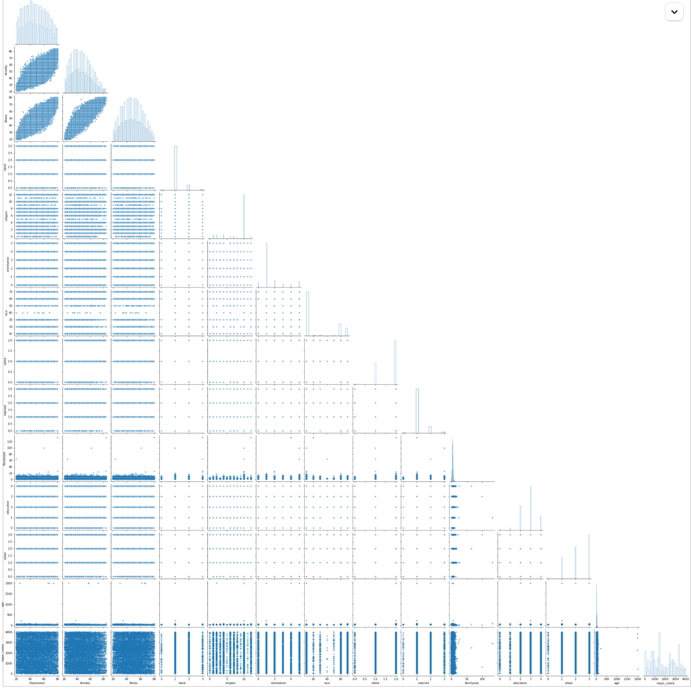

# A look into the top mental illnesses and their influencing demographics.

It took me a while to come up with an intriguing enough title. However, I feel fairly certain this one is good enough to bring a sort of awareness to the topic at hand.

For this thesis topic, I chose to look at these 3 mental illnesses which in my opinion are the silent killers some people seem to not take seriously enough:

* Anxiety
* Depression
* Stress

The data used was collected for a while up to and including 2018 and its demographics are explained in the "cookbook".  For this analysis, I considered the answers to the questions Q1 - Q42, ignoring the 10 Item Personality inventory, while considering other demographics like:

* age
* country
* education
* familysize
* hand
* major
* married
* orientation
* race
* religion
* urban
* voted

## Process

Initially, I thought it would be necessary to separate the questions into those concerning the different diseases according to the handbook taken from the site. The _type_ of Question is recorded [here](https://http://www2.psy.unsw.edu.au/dass//Download%20files/Dass_template.pdf).

Then looking at the total scores of each disease for each record, I compared them to the scoring on the DASS webpage for _normal, mild, moderate, severe_ and _extemely severe_ .

|                  | Depression | Anxiety | Stress |
| ------------------ | ------------ | --------- | -------- |
| Normal           | 0-9        | 0-7     | 0-14   |
| Mild             | 10-13      | 8-9     | 15-18  |
| Moderate         | 14-20      | 10-14   | 19-25  |
| Severe           | 21-27      | 15-19   | 26-33  |
| Extremely Severe | 28++       | 20++    | 34++   |

At this point, I was asking myself what percentage of my population falls in each category, and what I found would shock you.

### Depression

|                    | Depression |
| -------------------- | ------------ |
| _Normal_           | 0          |
| _Mild_             | 0          |
| _Moderate_         | 0.93%      |
| _Severe_           | 9.29%      |
| _Extremely Severe_ | 89.76%     |

### Anxiety

|                  | Anxiety |
| ------------------ | --------- |
| Normal           | 0       |
| Mild             | 0       |
| Moderate         | 0       |
| Severe           | 0       |
| Extremely Severe | 100     |

### Stress

|                  | Anxiety |
| ------------------ | --------- |
| Normal           | 0       |
| Mild             | 0       |
| Moderate         | 0.51%   |
| Severe           | 6.53%   |
| Extremely Severe | 92.95%  |

Knowing what percentage of people fall in each range, I went ahead to look for relationships between the demographics and these 3.

The obvious route was to make a sort of pairplots to easily identify any sort of relationships :

  
  
  👎 From the graph alone, I don't know about you,  but I couldn't identify any outstanding relationships.

However, calculating their regression coefficients, I was able to get some insights on whta demographics were more important than others. All I that was left was to test my hypothesis and _decide what demographics I should have thrown out and what I did ok to leave in_.

To get an idea of how Depression, Anxiety and Stress differ in different countries, I plotted them by country. Judging by the bulk of points which appear around Malaysia, I will take an educated guess that a large percentage of the survey was answered by people in Malaysia - 66% to be exact. Because I would love the audience to come up with their own hypotheses, the graph is interactive so we can all do some eyeballing based on the densities and sizes of the points. __IMHO__ though, there is something to be said about Malaysia and USA concerning all 3 diseases. So we begin to ask ourselves what is wrong with those countries? _Does the bulk of the population coming from Malaysia influence trend on the general population?_ __I honestly hope not 😄__
